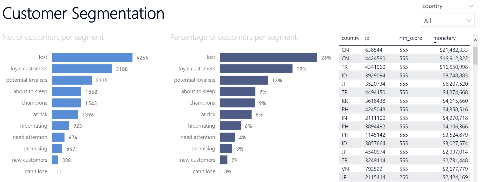
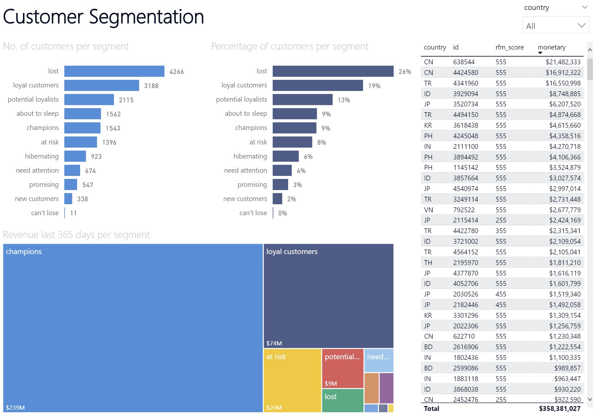
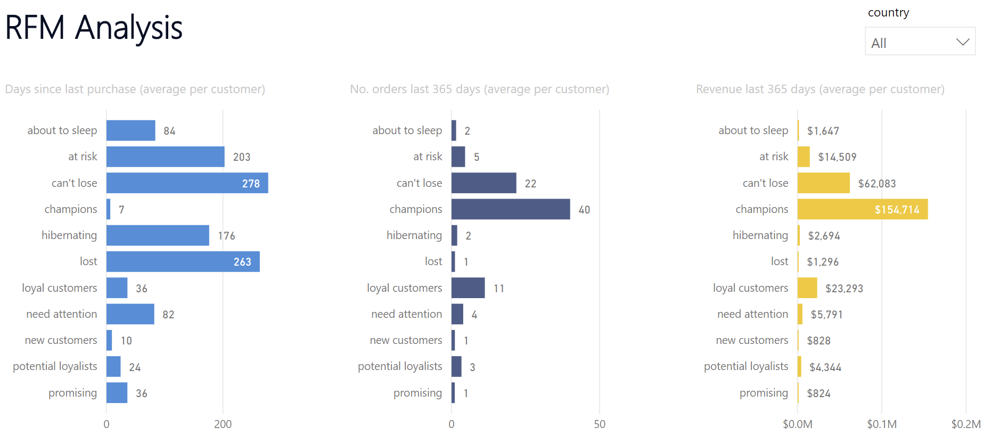
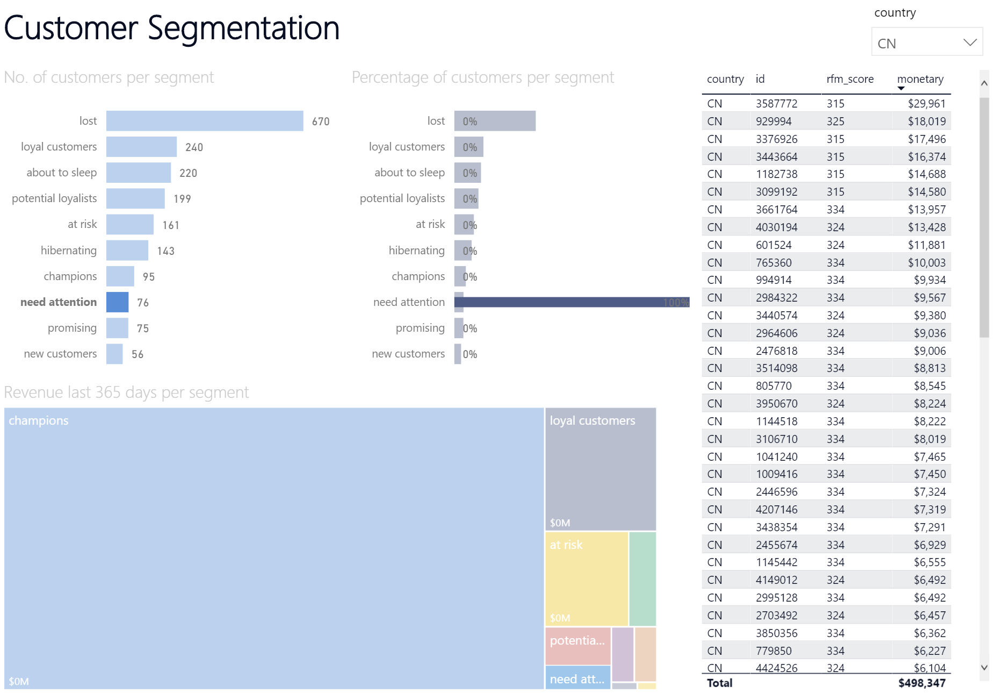
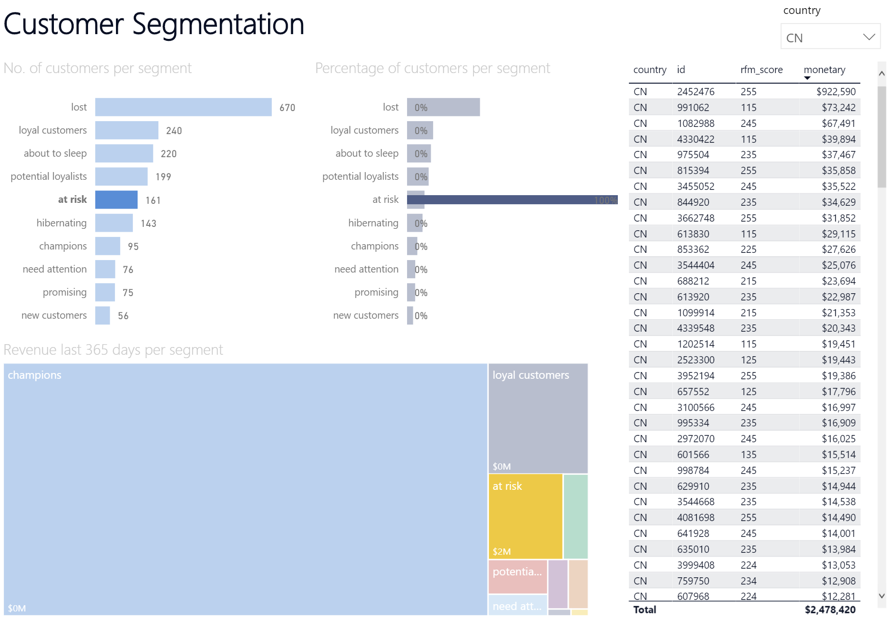
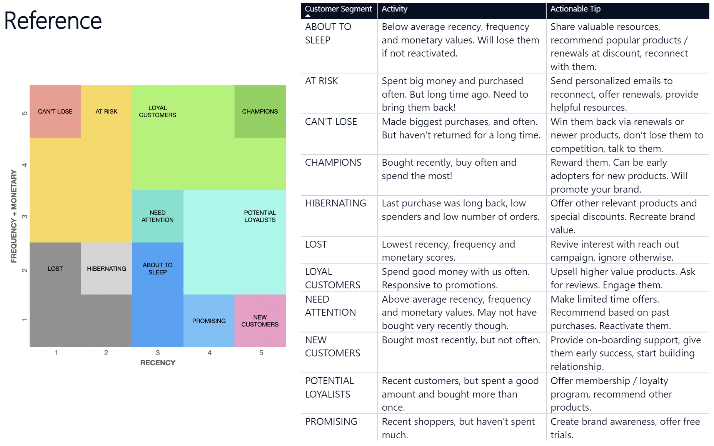

# Customer Segmentation with RFM Analysis, using Python and Power BI

# Table of Contents

[Introduction](#introduction)  
[Methodology](#methodology)  
[Requirements](#requirements)  
[Execution Guide](#execution-Guide)  
[Data Acquisition](#data-acquisition)  
[Data Preparation](#data-preparation)  
[Raw Data Description](#raw-data-description)  
[Data Exploration](#data-exploration)  
[Modeling](#modeling)  
[Summary](#summary)  
[Front-end](#front-end)  
[Conclusions](#conclusions)  
[References](#references)  
[About Me](#about-me)

# Introduction

While working in a company that serves goods to thousands of customers in several countries, I wanted to **create a tool** that would be useful to the sales managers in those countries by quickly showcasing **what customers to contact next**, in order to **grow sales** and **customer retention**. That is how I came to know about RFM analysis.

**RFM** is a method used for analyzing customer value. It is commonly used in database marketing and direct marketing and has received particular attention in retail and professional services industries.

This project focuses on doing RFM analysis on company sales and creating a **data visualization dashboard** showcasing **customer segmentation** that I can share with colleagues in the countries.

# Methodology

Using a dataset that contains **sales orders** in a period of time, we will use **Python** to obtain the **frequency, recency** and **monetary** values in the last 365 days per customer. Later with those values we will give **R, F, and M scores** to each customer, that will allow us to cluster them in different **segments**.

# Requirements

We'll use the [Google Colaboratory](https://colab.research.google.com/) Jupyter notebook environment (free), with Python 3.7 or higher, and [Microsoft Power BI Desktop](https://powerbi.microsoft.com/en-us/downloads/) application (free download, Windows only).

### Python packages

* numpy
* pandas
* math
* datetime
* dataprep
* matplotlib

# Front-end

The front-end of this project consists in a **Power BI dashboard** that processes the CSV resulting from executing the previous Python code, and visualizes the results in a pleasing dashboard. That dashboard then can be shared with multiple colleagues in the different countries of the company. You can access that file [here](output/customer_segmentation.pbix) for exploring it.

We observe that a lot of our customers (32 %) are **lost** or **hibernating** (they have a few orders from long ago). However, 28 % of our customers are either **champions** or **loyal customers**, meaning they spend the most and frequently. A segment to take care is **can't lose**, second segment with highest revenue, comprised of customers who used to spend a lot but have not returned in a while.

### User Manual

We can share the dashboard with our country sales managers so they can be **guided to the customer id's on the different segments** and **take specific actions on them**. Let's view an example: my Chinese colleague needs to be guided on what customers to contact next to **improve customer retention** or to **increase sales**. They would just need to open this dashboard, click on country (top right) and then on customer segment **need attention** or **at risk**, to have a specific list of customers, ordered by revenue spent in the last 365 days. (An unedited dataset would also include customer names and contact details, which in this case have been omitted for privacy reasons).

A **reference guide** to the 11 segments and suggested actions per segment is included in the last tab of the dashboard.

# Conclusions

**Customer segmentation** with the **RFM** methodology in sales is an effective way to help employees to focus their efforts by **targeting customers on a priority basis** and taking different actions on them. This kind of project **flexible** as the number of segments can be adapted to the business needs, and the period of time in the analysis can be extended or reduced as well. The use of Power BI to **share** the dashboard to colleagues in an enterprise environment as a web app is very convenient for companies already working in the Microsoft ecosystem.

# References

[**Guillaume Martin** - RFM Segmentation with Python](https://guillaume-martin.github.io/rfm-segmentation-with-python.html)

[**Google Cloud** - Predicting Customer Lifetime Value with AI Platform](https://cloud.google.com/architecture/clv-prediction-with-offline-training-intro#overview)

